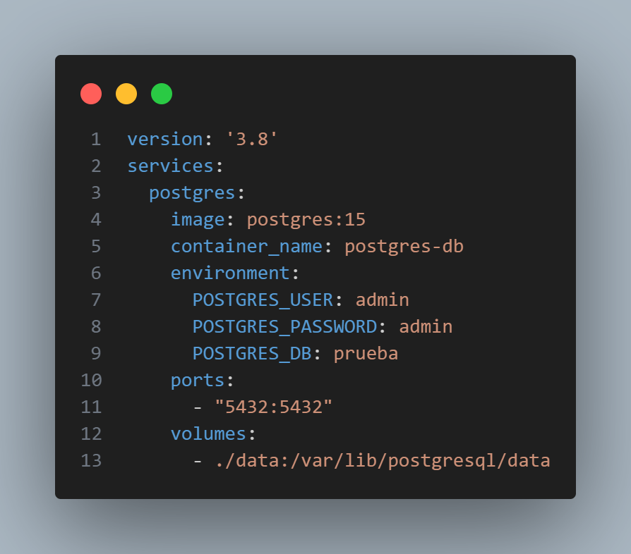

# AAD_25_26-Acceso-a-datos-

<!-- TOC -->

* [AAD_25_26-Acceso-a-datos-](#aad_25_26-acceso-a-datos-)
* [1. Qué es un conector y su papel en la aplicación.](#1-qué-es-un-conector-y-su-papel-en-la-aplicación)
* [2. Cómo has levantado el servicio PostgreSQL.](#2-cómo-has-levantado-el-servicio-postgresql)
* [3. DOCKER-COMPOSE.YML](#3-docker-composeyml)
* [4. Cómo has conectado a la base de datos PostgreSQL.](#4-cómo-has-conectado-a-la-base-de-datos-postgresql)
* [5. JDBC y su papel en la aplicación](#5-jdbc-y-su-papel-en-la-aplicación)
* [6. `application.yml` y el código de prueba](#6-applicationyml-y-el-código-de-prueba)
* [7. Ejecutar el contenedor y verificar la conexión desde IntelliJ](#7-ejecutar-el-contenedor-y-verificar-la-conexión-desde-intellij)
* [8. Descripción del modelo relacional](#8-descripción-del-modelo-relacional)
* [9. Resumen del modelo relacional](#9-resumen-del-modelo-relacional)

<!-- TOC -->

# 1. Qué es un conector y su papel en la aplicación.

- Un conector es un software que sirve de puente para conectar nuestra aplicación con una base de datos. Permite que la
  aplicación envíe consultas y reciba resultados de la base de datos de manera eficiente y segura.

# 2. Cómo has levantado el servicio PostgreSQL.

- Para levantar el servicio Postgres en Docker, puedes usar el siguiente comando: docker compose up -d (en la carpeta
  donde se encuentra el archivo docker-compose.yml).

# 3. DOCKER-COMPOSE.YML



``` 
    version: '3.8'
    services:
      postgres:
        image: postgres:15
        container_name: postgres-db
        environment:
          POSTGRES_USER: admin
          POSTGRES_PASSWORD: admin
          POSTGRES_DB: prueba
        ports:
          - "5432:5432"
        volumes:
          - ./data:/var/lib/postgresql/data
```    

# 4. Cómo has conectado a la base de datos PostgreSQL.

- Para probar la conexión, creamos una nueva con un gestor como DBeaver o PgAdmin, utilizando los siguientes datos:

| PARÁMETRO  | VALOR     |
|------------|-----------|
| PUERTO     | 5432      |
| USUARIO    | admin     |
| CONTRASEÑA | admin     |
| BBDD       | prueba    |
| HOST       | localhost |

# 5. JDBC y su papel en la aplicación

- JDBC (Java Database Connectivity) es la API estándar de Java para conectar y ejecutar sentencias SQL en bases de
  datos.
- En esta aplicación se usa JDBC para abrir conexiones con PostgreSQL mediante `DriverManager.getConnection(...)`.
- Un componente (bean) central encapsula la obtención de la conexión, carga del driver JDBC y gestión de credenciales;
  así el resto de la aplicación solicita conexiones a ese componente y no gestiona directamente URL/credenciales.

# 6. `application.yml` y el código de prueba

- `application.yml` contiene las propiedades de conexión que inyecta Spring: `spring.datasource.url`,
  `spring.datasource.username`, `spring.datasource.password` y `spring.datasource.driver-class-name`.
- Asegurarse de que la clave del driver usa guiones: `driver-class-name`.
- Código de prueba (resumen):
    - Clase `PostgresqlDriver` anotada con `@Component`.
    - Inyección por constructor con `@Value` para leer las propiedades de `application.yml`.
    - En el constructor se intenta cargar la clase del driver (`Class.forName(...)`) para detectar problemas temprano.
    - Método `getConnection()` devuelve `DriverManager.getConnection(url, username, password)`.
- Verificar que el `pom.xml` incluye la dependencia `org.postgresql:postgresql`.

# 7. Ejecutar el contenedor y verificar la conexión desde IntelliJ

1. Levantar el contenedor:
    - Abrir terminal en la raíz del proyecto (donde está `docker-compose.yml`).
    - Ejecutar: `docker compose up -d`
    - Comprobar que el contenedor está corriendo: `docker ps`

2. Verificar puerto y accesibilidad:
    - Asegurar que el contenedor publica el puerto `5432:5432`.
    - Probar conexión con `psql`, DBeaver o PgAdmin usando los datos en la tabla anterior.

3. Verificar desde IntelliJ (Database / Data Sources):
    - Abrir ventana *Database* (View \> Tool Windows \> Database).
    - Pulsar *+* \> *Data Source* \> *PostgreSQL*.
    - Rellenar: Host `localhost`, Port `5432`, Database `prueba`, User `admin`, Password `admin`.
    - Click en *Test Connection*; si falta el driver, IntelliJ ofrecerá descargarlo.

4. Ejecutar la aplicación Spring Boot:
    - Ejecutar `JrcApplication` desde IntelliJ (botón Run).
    - Revisar logs: si las propiedades están correctas la aplicación creará el bean `PostgresqlDriver` y podrá obtener
      conexiones.
    - Si hay errores de propiedades no resueltas, ejecutar con `--debug` o revisar `application.yml`.

5. Diagnóstico habitual:
    - Propiedades mal escritas (p. ej. `driver-classname` vs `driver-class-name`).
    - Dependencia de `org.postgresql:postgresql` faltante en `pom.xml`.
    - Driver con nombre parcial o mal tipeado.

6. AMPLIACIÓN DE FUNCIONALIDAD DE LA CLASE POSTGRESQLDRIVER.JAVA
   • Añadir métodos para crear las tablas ALUMNO, MODULO y MATRICULA.
    - Uso de funciones init() y executeSql() para ejecutar las sentencias SQL de creación de tablas.

7. Crear las tablas en la base de datos PostgreSQL
   • Sentencias SQL para crear las tablas:
    ```sql
    CREATE TABLE IF NOT EXISTS alumno
    (
    id_alumno SERIAL PRIMARY KEY,
    nombre    VARCHAR(100)        NOT NULL,
    email     VARCHAR(100) UNIQUE NOT NULL
    );
    CREATE TABLE IF NOT EXISTS modulo
    (
    id_modulo SERIAL PRIMARY KEY,
    nombre    VARCHAR(100) NOT NULL,
    horas     INT CHECK (horas > 0)
    );
    CREATE TABLE IF NOT EXISTS matricula
    (
    id_alumno INT NOT NULL REFERENCES alumno (id_alumno) ON DELETE CASCADE,
    id_modulo INT NOT NULL REFERENCES modulo (id_modulo) ON DELETE CASCADE,
    fecha     DATE DEFAULT CURRENT_DATE,
    PRIMARY KEY (id_alumno, id_modulo)
    );
   ```

8. Descripción del modelo relacional
    - Las tablas representan un sistema de gestión académica con alumnos, módulos y matrículas.
    - Relaciones entre tablas
        - Un alumno puede estar matriculado en múltiples módulos (relación muchos a muchos).
        - Un módulo puede tener múltiples alumnos matriculados.
        - La tabla MATRICULA actúa como tabla intermedia para gestionar esta relación.

9. Resumen del modelo relacional
    - Tablas:
        - ALUMNO: almacena información de los alumnos (id, nombre, email).
        - MODULO: almacena información de los módulos (id, nombre, horas).
        - MATRICULA: tabla intermedia que relaciona alumnos y módulos, con fecha de matrícula.

    - Relaciones:
        - ALUMNO (1) ───< (N) MATRICULA (N) >─── (1) MODULO


